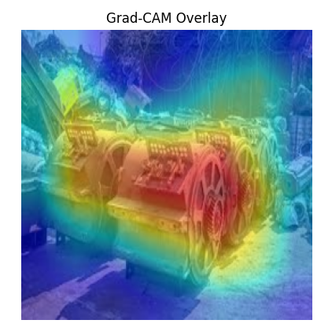
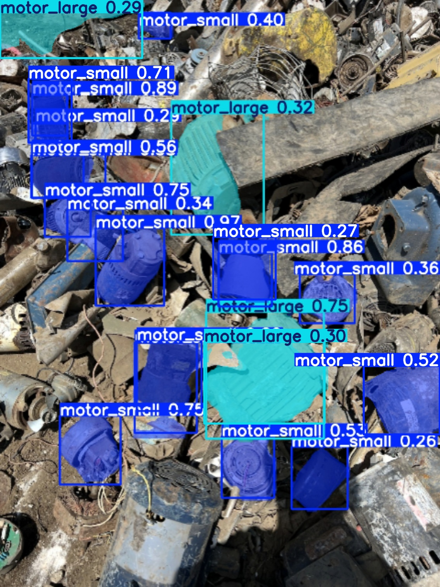
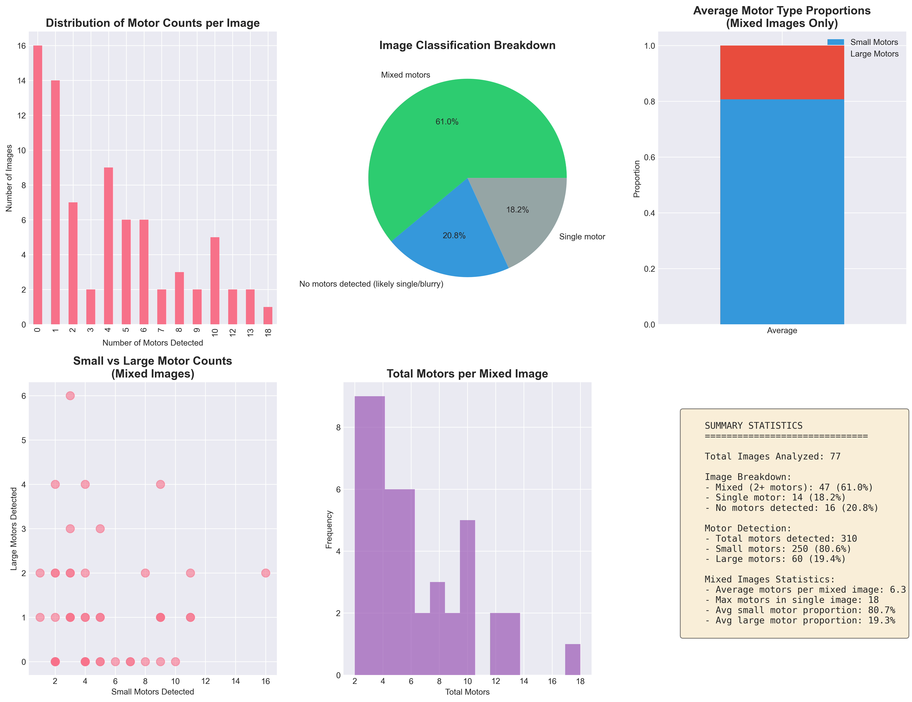

# Binary Motor Classifier and Segementation System 🔧

This project implements a binary image classifier to distinguish between **small** and **large** electric motors in scrap piles using a fine-tuned ResNet18 model. The pipeline includes data review, training, prediction, Grad-CAM visualization, and background preprocessing. The segmenetation system is used for analyzing motor proportions in mixed images


---

## ⚙️ Setup

Create a Python environment and install dependencies:

```bash
python -m venv env
source env/bin/activate
pip install -r requirements.txt
```

---

## 🧪 Workflow

### 1. **Label Review (Optional Manual Labeling)**

Review and label raw images using a Streamlit tool:

```bash
streamlit run src/review_labels.py
```

This creates `labels_large_small_reviewed.csv`.

I originally had a script called generate_labels_csv.py and ran the pipeline described below. This labelled the images based on the file name and this returned an accuracy of 90% on the highest Epoch but I wanted to improve it so I manually reviewed every photo and found some photos that were labelled large were small and vice-versa and some photos were blurry / mixed which diluted the data. So with streamlit I manually labelled all 374 images.

---

### 2. **Train Classifier**

Train the ResNet18 model on labeled data:

```bash
python src/train.py
```

Model weights will be saved in `models/`. I fine tuned this by playing around with the sigmoid function and I found 0.6 being optimal. Since the binary classifier works on a scale from 0 - 1, where 0 is small and 1 is large, if it is useful in the future depending how in the yard we want to use this, we can find a thresh hold (such as 0.35-0.80) which we label as mixed motors.

---

### 3. **Make Predictions**

Run prediction on a single image:

```bash
python src/predict.py data/raw/sample_motor.jpg
```

You’ll get the predicted class and probability example:
```bash
python src/predict.py 'data/Motor_Auto-starter-solenoid_masked.jpg'
# Output: Prediction: small (confidence: 0.0929)
```

The closer the value is to 0% the more confidence it is small, the closer the value is to 100% the more confident it is that it's large.

---

### 4. **Visualize with Grad-CAM**

Use Grad-CAM to visualize what the model is focusing on:

```bash
python src/gradcam.py data/raw/sample_motor.jpg
```

Here is an example of using gradcam on large motor I found on Google.



---

## 🧠 Model Details

* **Architecture**: ResNet18
* **Loss**: Binary Cross Entropy with optional focal loss
* **Augmentation**: Random crop, flip, color jitter, etc. (via `albumentations`)
* **Grad-CAM**: Shows model focus layer activations

---

## 📝 Notes and Things for the Future

* All paths are relative to the project root.
* Model expects images with visible motor objects centered in view.
* Predictions closer to 0 → **small**, closer to 1 → **large**.

Depending on how we want to integrate this into our future pipeline for the actual work done on yards I will tweak it accordingly. And a big key point is once we get LiDar or just a camera mount setup where we can get the same pile/stack from multiple angles I will setup a pipeline that can do 3D assimilation which can scan exact areas/volume and this also applies to the density model.

---

## ✨ Accuracy Validation

Based on of 10 epochs the peak accuracy was 96.7%

```base
(env) PS C:\Users\kevin\Downloads\metaldensity2> python src/train.py
Epoch 1: Train Loss=0.1308, Val Loss=0.0542, Val Acc=0.9000
Epoch 2: Train Loss=0.0585, Val Loss=0.0431, Val Acc=0.8833
Epoch 3: Train Loss=0.0416, Val Loss=0.0771, Val Acc=0.8833
Epoch 4: Train Loss=0.0281, Val Loss=0.0373, Val Acc=0.9333
Epoch 5: Train Loss=0.0280, Val Loss=0.0334, Val Acc=0.9500
Epoch 6: Train Loss=0.0169, Val Loss=0.0525, Val Acc=0.9333
Epoch 7: Train Loss=0.0194, Val Loss=0.0359, Val Acc=0.9500
Epoch 8: Train Loss=0.0163, Val Loss=0.0257, Val Acc=0.9667
Epoch 9: Train Loss=0.0144, Val Loss=0.0246, Val Acc=0.9500
Epoch 10: Train Loss=0.0054, Val Loss=0.0357, Val Acc=0.9333
```

---

## 🧠 Segmentation Model for Motor Proportions

## Workflow

### 1. Data Preparation
- Started with labeled set of single and mixed motor images
- Deleted mixed motor images with `mixed_motor_identifier.py`
- Deleted 77 "mixed" labeled images (many were actually blurry singles)

### 2. Manual Annotation
- Made LabelMe annotation project with `annotation_workflow.py`
- Hand-drew polygon segmentation masks for singles
- Manually annotated 10 images of 55 total motors (43 small, 12 large)

Example:



### 3. Conversion of Data
- Converted LabelMe annotations to COCO format for compatibility
- Executed YOLO segmentation format labels from COCO annotations
- Created train/validation splits to train the model

### 4. Training the Model
- Trained YOLOv8n-seg model with rigorous augmentation to compensate for limited data
- Fined-tuned at 91.9% mAP@50 (95.5% small motors, 88.2% large motors)
- Trained in ~1 hour on CPU with 300 epochs

## Results
- Properly analyzed 77 images
- Found 47 mixed motor images with average proportion: 80.7% small, 19.3% large
- Below is the report of the detailed analysis and the model is saved as best.py in models/motor_seg_fixed/weights/best.pt



## Analysis Results

### Summary Statistics
- **Total images analyzed:** 77
- **Mixed motor images detected:** 47 (61%)
- **Single motor images:** 14 (18%)
- **No clear motors detected:** 16 (21%)

### Detection Breakdown

| Image Type | Count | Percentage |
|------------|-------|------------|
| Mixed motors (2+) | 47 | 61.0% |
| Single motor | 14 | 18.2% |
| No motors detected | 16 | 20.8% |

### Motor Count Distribution

| Motors per Image | Number of Images |
|-----------------|------------------|
| 0 | 16 |
| 1 | 14 |
| 2 | 7 |
| 3 | 2 |
| 4 | 9 |
| 5 | 6 |
| 6 | 6 |
| 7 | 2 |
| 8 | 3 |
| 9 | 2 |
| 10 | 5 |
| 12 | 2 |
| 13 | 2 |
| 18 | 1 |

### Mixed Image Analysis
For the 47 images containing multiple motors:
- **Average small motor proportion:** 80.71%
- **Average large motor proportion:** 19.29%
- **Average motors per mixed image:** 6.7

### Model Performance
- **Binary Classifier:** 96% validation accuracy
- **Segmentation Model:** 91.9% mAP@50
  - Small motors: 95.5% mAP@50
  - Large motors: 88.2% mAP@50